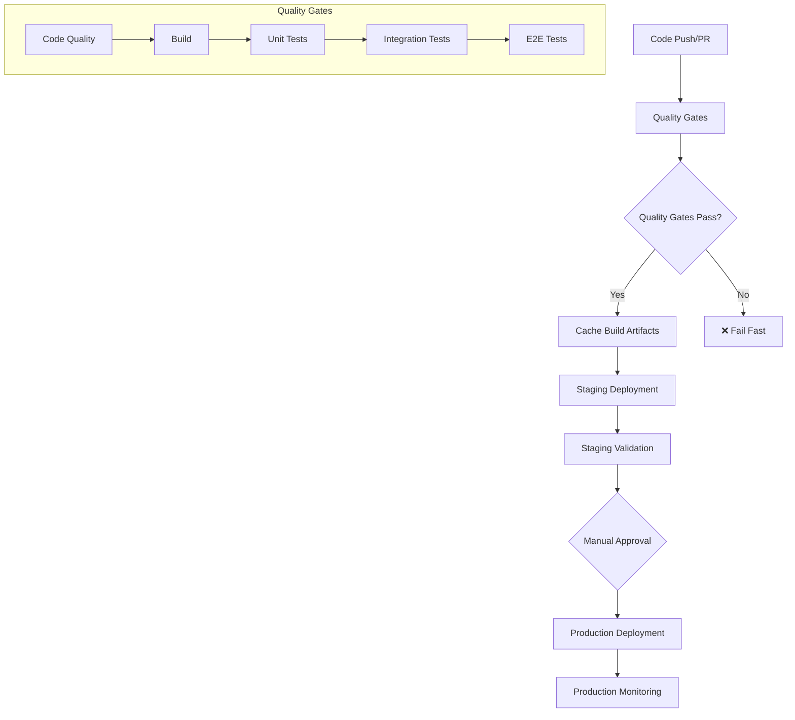

# CI/CD Architecture Refactor

## Problem
- Tests run before TypeScript compilation, causing failures
- Inconsistent build processes across workflows  
- No artifact caching, leading to slow deployments
- Mixed testing environments causing unreliable results
- Deprecated GitHub Actions causing workflow failures
- Automatic production deployments without safeguards

## Solution
Refactored CI/CD pipeline with proper build order, artifact caching, and separated test environments.

## Architecture Principles

### Build Once, Deploy Many
- Single build process generates artifacts for all environments
- Eliminates build inconsistencies
- Reduces deployment time

### Progressive Quality Gates  
- Structured testing pipeline with clear failure points
- Parallel execution where possible
- Validation before deployment

### Artifact Caching
- Build artifacts cached and reused across workflows
- Dependencies cached across runs
- Cache invalidation based on code changes

### Environment Parity
- Consistent deployment process for staging and production
- Same build artifacts promoted through environments

## Workflow Architecture



## File Structure

```
.github/workflows/
├── quality-gates.yml           # NEW: Quality validation workflow
├── deploy-staging.yml          # REFACTORED: Staging deployment with caching
├── deploy-production.yml       # REFACTORED: Production deployment with safeguards
├── pr-quality-checks.yml       # UPDATED: Streamlined PR checks
├── deploy-staging-legacy.yml   # BACKUP: Previous staging workflow
└── deploy-production-legacy.yml # BACKUP: Previous production workflow

jest.config.unit.js             # Unit test configuration
jest.config.integration.js      # Integration test configuration  
jest.config.e2e.js              # E2E test configuration

tests/setup/
├── unit.setup.js               # Unit test environment setup
├── integration.setup.js        # Integration test environment setup
└── e2e.setup.js                # E2E test environment setup
```

## Testing Strategy

### Unit Tests (`jest.config.unit.js`)
- Purpose: Fast, isolated logic testing
- Environment: Node.js with mocking
- Coverage Target: 85%
- Execution Time: < 30 seconds

### Integration Tests (`jest.config.integration.js`)
- Purpose: Service integration with mocked external APIs
- Environment: Miniflare (Cloudflare Workers simulation)
- Coverage Target: 70%
- Execution Time: < 2 minutes

### E2E Tests (`jest.config.e2e.js`)
- Purpose: Full workflow testing with real services
- Environment: Compiled code with optional real API calls
- Coverage: Not measured
- Execution Time: < 10 minutes

## Deployment Workflows

### Quality Gates Workflow (`quality-gates.yml`)

**Triggers:**
- Pull requests
- Pushes to main/develop/feature branches
- Called by other workflows

**Process:**
1. Code Quality Checks (type checking, linting, format validation, security audit)
2. Build & Test Pipeline (generate cache key, build if needed, run tests, cache artifacts)
3. Deployment Readiness Check (validate configuration, confirm prerequisites)

**Outputs:**
- `build-cache-key`: For artifact reuse
- `build-success`: Boolean success indicator

### Staging Deployment (`deploy-staging.yml`)

**Triggers:**
- Pushes to main branch
- Manual dispatch with options

**Process:**
1. Inherit Quality Gates (runs quality gates workflow, waits for completion)
2. Artifact Management (restore cached artifacts, rebuild if needed)
3. Environment Deployment (validate prerequisites, deploy to staging, configure webhook)
4. Validation & Testing (health checks, smoke tests, performance validation)
5. Post-Deployment (create tracking issue, update status, mark ready for production)

### Production Deployment (`deploy-production.yml`)

**Triggers:**
- Manual dispatch only (safer than automatic deployment)

**Why Manual Only?**
- Prevents accidental production deployments
- Requires explicit deployment reason and approval
- Allows validation of staging environment first
- Provides better audit trail and control

**Process:**
1. Pre-Deployment Validation (validate commit, check staging status, timing validation)
2. Quality Gates Inheritance (run quality gates for specific commit)
3. Production Deployment (prerequisite checks, GitHub deployment record, deploy, configure webhook)
4. Post-Deployment Verification (health checks, smoke tests, status tracking)
5. Monitoring Setup (tracking issue, 60-minute monitoring period, rollback procedures)

## Package Scripts

Key changes:
- `test:e2e`: Now builds before running E2E tests
- `build:ci`: Includes type-check and cleanup
- Separate watch modes for different test types

## Migration

### Activation Steps
1. Test locally: `npm run test:all && npm run build:ci`
2. Run validation script: `./scripts/migrate-to-ci-refactor.sh` 
3. The refactored workflows are already active:
   - `deploy-staging.yml` - New staging deployment
   - `deploy-production.yml` - New production deployment (manual trigger)
   - Legacy workflows removed for security

### Benefits
- Fixes build order issue (tests after compilation)
- Faster deployments through artifact caching
- Proper test environment separation
- Manual production approval for safety

## GitHub Actions Maintenance

### Deprecated Actions Updates
The system uses current GitHub Actions versions to avoid deprecation warnings:

- ✅ `actions/upload-artifact@v4` (was v3, deprecated April 2024)
- ✅ `actions/cache@v4` (was v3)  
- ✅ `cloudflare/wrangler-action@v3` (latest available)

### Common GitHub Actions Issues

**Error:** `This request has been automatically failed because it uses a deprecated version of actions/upload-artifact: v3`

**Solution:** Update to v4 in all workflow files:
```yaml
# OLD (deprecated)
uses: actions/upload-artifact@v3

# NEW (current)  
uses: actions/upload-artifact@v4
```

**Files to check:**
- `.github/workflows/quality-gates.yml`
- `.github/workflows/deploy-staging.yml`
- `.github/workflows/deploy-production.yml`

## Emergency Procedures

### Rollback Production
```bash
wrangler rollback --env production
```

### Emergency Deployment
Use the `skip_staging_validation` option in production deployment workflow to bypass staging validation.

### Health Check Failures
1. Check Cloudflare Worker status
2. Verify webhook configuration  
3. Test with basic API calls
4. Review deployment logs
5. Rollback if necessary

## Files

- Quality Gates: `.github/workflows/quality-gates.yml`
- Staging Deployment: `.github/workflows/deploy-staging.yml`
- Production Deployment: `.github/workflows/deploy-production.yml`
- Test Configs: `jest.config.*.js`
